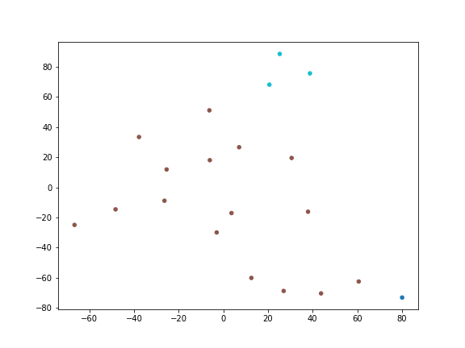

# LLM-Based YouTube Comment Analysis and Moderation

Analyze and moderate YouTube comments using LLM classification and prompt engineering.

## Clustering Visualization

Comments are converted to embeddings using a pre-trained sentence model, clustered with K-means (5 clusters), and projected to 2D with t-SNE. Each point is a comment, colored by cluster. Red X marks are cluster centroids.

## Video
[Sam Altman: OpenAI CEO on GPT-4, ChatGPT, and the Future of AI](https://www.youtube.com/watch?v=L_Guz73e6fw)

## Pipeline

| Step | Script | Output |
|------|--------|--------|
| Install requirements | setup_requirements.py | - |
| Extract comments | 01_extract.py | comments.json |
| Count comments | 02_count.py | - |
| Create database | 03_database.py | comments.db |
| Sample data | sample_data.json, prompt.txt | - |
| Ping LLM | 05_ping_llm.py | - |
| Classify comments | 06_prediction.py | comments.db (updated) |
| Generate responses | 07_create_responses.py | comments.db (updated) |
| Extract categories | 08_categories.py | categories.json |
| Visualize clusters | 09_visualization.py | clusters.png |
| Export dataset | 11_export.py | clean_dataset.json |
| Run full pipeline | 12_pipeline.py | all of the above |

## Dataset Structure (clean_dataset.json)

| Column | Type | Description |
|--------|------|-------------|
| cid | string | Unique comment ID from YouTube |
| text | string | Comment text content |
| time | string | Relative time string (e.g. "2 years ago") |
| author | string | Comment author name |
| channel | string | Author YouTube channel ID |
| votes | string | Number of likes on the comment |
| photo | string | Author profile photo URL |
| heart | string | Whether the comment received a creator heart |
| reply | string | Whether this comment is a reply to another comment |
| time_parsed | string | Parsed Unix timestamp |
| negative | string | LLM classification: negative sentiment (True/False) |
| angry | string | LLM classification: angry tone (True/False) |
| spam | string | LLM classification: spam content (True/False) |
| response | string | LLM classification: needs response (True/False) |
| responses | string | Generated response text (null if not applicable) |

Assumptions and Decisions:
- Classification results are LLM predictions using gemma3:270m (~85% accuracy) and may contain misclassifications, especially for long comments or subtle tone
- All values are stored as strings due to SQLite's flexible typing. Boolean fields use "True"/"False" strings
- The response field is primarily based on question mark ("?") presence, as this was the most reliable signal for the model
- Comments are a point-in-time snapshot and may not reflect the current state of the video
- The responses column is only populated for comments where response=True

## Model Selection

Using gemma3:270m via Ollama. Initially tested gemma3:1b (larger model), but found that both models struggle with classification accuracy without good prompts. On a 2-core Codespace environment, the smaller model runs significantly faster while achieving comparable results when paired with a well-engineered prompt. This led to a strategy shift: prompt engineering matters more than model size for this classification task.

## Prompt Engineering

Tested 28 prompt variations (v2–v29) against a 25-comment ground truth dataset (see `prompts/` folder). Key findings:
- Too many few-shot examples cause the small model to over-trigger or copy the first example
- Explicit "NOT negative" rules for praise/jokes prevent false positives
- Defining response detection via "?" question marks gives clearer signal than vague definitions
- Adding specific insult words (clown, sleazy, idiot) helps angry detection
- Best result: prompt_v17 — 85% overall accuracy (angry 92%, negative 76%, response 80%, spam 92%)
